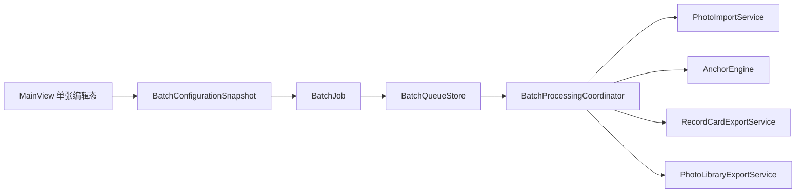
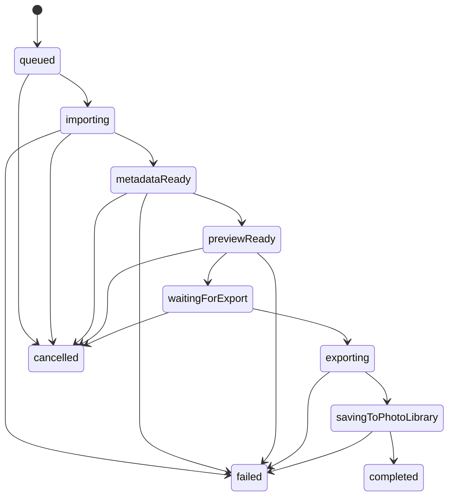

# PhotoMemo 批量任务系统设计

## 目标

PhotoMemo 现在已经具备单张链路：

1. 选择一张照片
2. 读取 EXIF / 拍摄时间
3. 结合模板与时间锚点生成真实 context
4. 实时预览
5. 导出并写入系统图库

下一步不应该推倒重来，而是把这条单张链路包装成一个可复用的批量流水线，让用户可以：

1. 从系统分享、拖入、文件选择一次送入多张图片
2. 沿用当前已调好的模板、锚点、说明写入偏好
3. 让后台自动逐张处理
4. 前台继续查看当前进度、失败项、重试项
5. 最终统一写入系统图库与指定相册

这套系统的核心原则是：

- 单张编辑保留，继续作为“校准模板”的工作台
- 批量任务独立，不直接污染 `selectedPhoto` / `currentCard`
- 配置冻结后再跑批，避免处理中途配置漂移
- 读取、计算、预生成可并发
- 最终写图库必须串行或低并发
- 元数据保留策略沿用现有导出与图库写入能力

---

## 修正后的产品形态

根据当前最新需求，PhotoMemo 的产品形态需要明确修正为：

1. 主程序界面不是“批量导入和逐张操作界面”
2. 主程序界面长期只保留一张预览图
3. 这张预览图的意义是校准模板、锚点、自定义区域和说明写入规则
4. 用户日常真正使用时，不进入主程序手动导入
5. 用户在系统相册、文件、图片浏览器里直接选中图片后，通过“分享给 PhotoMemo”或类似入口触发处理
6. PhotoMemo 在后台自动生成新图，并写回系统图库 / 指定相册

所以从产品定位上，主程序应该被理解为：

- `模板与规则编辑器`
- `效果预览器`
- `默认处理策略设置中心`

而不是：

- `日常批量作业操作台`

这会直接影响后续架构：

- 主界面不需要长期显示批量导入器
- 主界面不需要常驻多张任务编辑表单
- 真正重要的是后台接单、自动排队、自动处理、自动落图库

---

## 现有代码基础

当前工程已经具备批量系统最关键的底座：

- `PhotoImportService.swift`
  - 已能读取单张图片、生成 `SelectedPhoto`
- `PhotoMetadataReader.swift`
  - 已能读取 EXIF / TIFF 时间、机型、镜头等
- `AnchorEngine.swift`
  - 已能基于锚点时间和拍摄时间生成“年岁 / 时长 / 倒计时 / 第X天”等结果
- `RecordCard.swift`
  - 已是最终渲染输入模型
- `RecordCardExportService.swift`
  - 已能生成最终合成图片并写出临时文件
- `PhotoLibraryExportService.swift`
  - 已能将结果写入系统图库与目标相册
- `MainView.swift`
  - 已经形成稳定的单张预览和四区编辑交互

这意味着批量系统不需要重做渲染器，也不需要重写时间锚点。真正要新增的是：

- 队列模型
- 任务状态机
- 批量运行器
- 前台/后台协同逻辑
- 与当前 `MainView` 的嵌入方式

---

## 总体结构

建议将批量系统拆成 4 层：

1. `BatchConfigurationSnapshot`
   - 记录“这一批任务”使用的冻结配置
2. `BatchJob` / `BatchTask`
   - 描述一批任务与每张图片当前状态
3. `BatchQueueStore`
   - 持有队列、状态变更、失败重试、取消能力
4. `BatchProcessingCoordinator`
   - 组织导入、预计算、渲染、写图库等流水线

建议关系：

补上一层系统反馈后，实际运行结构会更贴近最终产品：

- `MainView`
  - 继续只负责模板校准、锚点设置、说明写入偏好
- `ExternalPhotoIntakeCenter`
  - 负责接收“分享给 PhotoMemo / 打开文件 / 外部触发”的图片入口
- `BatchQueueStore`
  - 负责接单、排队、状态持久化、统计快照
- `BatchNotificationService`
  - 负责在后台任务开始、整批完成或失败时发送系统通知

这样主界面不会被批量控制台污染，后台任务也不会静默得毫无反馈。

---

## 数据模型

### 1. 批量配置快照

作用：

- 在用户点击“开始处理”时冻结当前模板、锚点、说明写入偏好
- 后续用户在主界面继续修改模板，不影响已开始的这一批

建议字段：

| 字段 | 类型 | 说明 |
| --- | --- | --- |
| `id` | `UUID` | 快照标识 |
| `createdAt` | `Date` | 快照生成时间 |
| `template` | `Template` | 当前模板完整副本 |
| `badge` | `Badge?` | 当前徽标配置 |
| `anchor` | `Anchor?` | 当前锚点完整副本，而不是只存 ID |
| `shouldWritePhotoDescription` | `Bool` | 是否写入相册说明 |
| `photoDescriptionOverride` | `String` | 用户自定义说明覆盖文本 |
| `selectedAlbumIdentifier` | `String` | 目标相册标识 |
| `titleText` | `String` | 当前标题草稿 |
| `storyText` | `String` | 当前说明草稿 |

说明：

- `anchor` 必须存完整对象，而不是只存 `selectedAnchorID`
- `template` 必须存完整结构，避免处理中用户修改四区内容导致已排队任务漂移

### 2. 单张批任务

作用：

- 表示一张图片从“进入队列”到“写入图库完成”的完整生命周期

建议字段：

| 字段 | 类型 | 说明 |
| --- | --- | --- |
| `id` | `UUID` | 任务标识 |
| `sourceURL` | `URL` | 原图地址 |
| `fileName` | `String` | 原图文件名 |
| `createdAt` | `Date` | 入队时间 |
| `phase` | `BatchTaskPhase` | 当前阶段 |
| `captureDate` | `Date?` | 已解析的拍摄时间 |
| `savedAlbumName` | `String?` | 最终写入的相册名称 |
| `savedAssetIdentifier` | `String?` | 系统图库资源标识 |
| `renderedFileURL` | `URL?` | 临时导出文件地址 |
| `retryCount` | `Int` | 重试次数 |
| `failure` | `BatchTaskFailure?` | 失败信息 |
| `progress` | `BatchTaskProgress` | 任务进度 |

说明：

- `savedAssetIdentifier` 后续可用于建立“处理结果与系统图库资源”的索引关系
- `captureDate` 提前存下，有利于列表预览和排序

### 3. 批次 Job

作用：

- 将多张任务组织成同一批
- 这一批共用一个冻结配置

建议字段：

| 字段 | 类型 | 说明 |
| --- | --- | --- |
| `id` | `UUID` | 批次标识 |
| `title` | `String` | 如“2026-06-18 早晨散步” |
| `createdAt` | `Date` | 创建时间 |
| `updatedAt` | `Date` | 最近更新时间 |
| `state` | `BatchJobState` | 批次状态 |
| `configuration` | `BatchConfigurationSnapshot` | 冻结配置 |
| `tasks` | `[BatchTask]` | 当前批次全部图片任务 |
| `policy` | `BatchPipelinePolicy` | 并发策略 |

### 4. 运行时缓存

不建议把 `SelectedPhoto`、`RecordCard`、缩略图这些大对象直接持久化到 `BatchTask`。

建议额外准备内存态缓存层：

- `selectedPhoto`
- `previewCard`
- `anchorResult`

它们只存在于运行期，由 `BatchProcessingCoordinator` 管理；持久化层只保留轻量字段。

这样做的好处：

- 队列恢复更轻
- 模型更适合未来迁移 iOS
- 内存占用更容易控制

---

## 队列状态机

### 批次状态

建议枚举：

- `draft`
- `queued`
- `preparing`
- `ready`
- `running`
- `completed`
- `failed`
- `cancelled`

语义：

- `draft`
  - 刚创建，尚未正式开始
- `queued`
  - 已入总队列，等待资源
- `preparing`
  - 正在预读取图片和元数据
- `ready`
  - 任务已可处理，等待进入导出阶段
- `running`
  - 正在渲染 / 写图库
- `completed`
  - 全部任务完成
- `failed`
  - 批次内存在失败项，且未全部恢复
- `cancelled`
  - 用户主动取消

### 单任务状态

建议枚举：

- `queued`
- `importing`
- `metadataReady`
- `previewReady`
- `waitingForExport`
- `exporting`
- `savingToPhotoLibrary`
- `completed`
- `failed`
- `cancelled`

状态流转：

### 为什么要拆成这么细

因为你后面一定会需要这些能力：

- 显示“已经读到 EXIF，但还没导出”
- 允许失败项只重跑后半段
- 列表里提前显示拍摄时间、年岁结果和缩略预览
- 导出阶段单独限流

如果状态过粗，后面 UI 会很难做精细反馈。

---

## 前台 / 后台流程

## 前台主程序模式

主程序前台继续保留现在的单张预览模式，但它的职责要重新定义：

1. 选择单张照片
2. 调整模板四区内容
3. 调整锚点
4. 看实时预览
5. 保存配置

这一层的意义不是“处理大量图片”，而是“把模板调准”。

也就是说，这一张预览图是：

- 校准图
- 样例图
- 模板测试图

而不是正式批量作业入口。

### 后台真实使用模式

当用户日常使用时，理想流程应该是：

1. 用户先在主程序里把模板、锚点、说明写入规则设好并保存
2. 用户在系统中选中一张或多张照片
3. 点击分享
4. 发送到 PhotoMemo
5. PhotoMemo 在后台基于“当前默认配置快照”自动生成任务
6. 后台自动完成渲染与写入图库
7. 用户回到系统相册，直接看到生成后的新图片

因此，前台并不承担“每次操作都要手动导入”的职责。

### 后台执行

后台协调器按批次执行：

1. 读取图片 URL
2. 调 `PhotoImportService` 生成 `SelectedPhoto`
3. 调 `AnchorEngine` 计算锚点结果
4. 组装 `RecordCard`
5. 调 `RecordCardExportService` 生成临时文件
6. 调 `PhotoLibraryExportService` 写入图库 / 相册
7. 回收临时文件
8. 更新任务状态

### 系统分享入口

你提出的目标是：

- 用户在系统中选中图片
- 点击“分享”
- 发送到 PhotoMemo / 开始处理 / 添加水印

这应该成为 PhotoMemo 的主入口，而不是辅助入口。

建议分阶段实现：

#### 第一阶段：当前工程内核先就位

先把真正重要的“后台任务内核”做好：

- 默认配置快照
- 接单队列
- 后台处理协调器
- 串行写图库
- 失败重试

这一步的目标是：即便入口先临时用文件选择模拟，底层也已经是“后台自动处理模型”。

#### 第二阶段：系统入口接入

再接具体入口：

- iOS `Share Extension`
- macOS 分享扩展 / 快捷操作 / Services
- `onOpenURL`
- 外部文件打开

这时入口只是把图片 URL 投递给后台队列，主程序本身不需要切到“导入页面”。

#### 第三阶段：跨进程收件箱

当要正式适配 iOS 时，建议补：

- App Group 收件箱目录
- 分享扩展写入任务描述文件
- 主 App 或后台代理读取收件箱并入队

这样批量队列模型可以直接复用，不需要重写。

---

## 并发策略

### 可以并发的步骤

这些步骤主要是“读”和“算”，对系统图库没有写冲突：

1. 读取安全域文件访问
2. 读取 EXIF / TIFF / 尺寸
3. 生成 `SelectedPhoto`
4. 计算锚点结果
5. 组装变量文本
6. 生成缩略图 / 预览文案

建议并发度：

- 导入并发：`2 ~ 3`
- 预计算并发：`2 ~ 3`
- 缩略预览并发：`2`

理由：

- 图片大，解码很吃内存
- 你的目标是“系统级顺滑”，不是把 CPU 一次打满

### 必须串行或低并发的步骤

这些步骤要严格控制：

1. `PHPhotoLibrary.performChanges`
2. 默认相册创建 / 查找
3. 最终写入系统图库
4. 临时文件生命周期管理

建议：

- 渲染导出：最多 `1 ~ 2`
- 写图库：固定 `1`

原因：

- `PHPhotoLibrary` 写入是最敏感的阶段
- 多张同时写入，失败定位和系统体验都更差
- 你还希望尽量保持拍摄时间和元数据一致，串行更稳

### 推荐流水线

不是“全串行”，也不是“全并行”，而是分段流水：

1. A 图正在写图库
2. B 图正在渲染导出
3. C 图正在读 EXIF / 算年岁
4. D 图排队等待

这就是最适合 PhotoMemo 的方式：

- 前段轻并发
- 后段串行

---

## 灵动岛 / 进度展示建议

这个能力有参考价值，但要明确平台边界：

- macOS 当前没有“灵动岛”
- 真正对应的是未来 iPhone 上的 `Live Activities`

所以建议设计成两层：

### 当前工程阶段

先做应用内统一进度源：

- `BatchQueueStore`
- `overallCompletedCount`
- `overallFailedCount`
- `currentRunningTaskName`
- `overallProgress`

这样主界面、菜单栏、通知、未来 iOS Live Activity 都能共用同一份状态。

### 未来 iOS 阶段

再增加一个桥接层：

- `LiveActivityBridge`

它只负责把队列进度映射为：

- 当前批次名称
- 已完成 / 总数
- 当前阶段
- 当前文件名

这样灵动岛只是“展示层”，不是任务引擎本身。

这点很重要，因为如果把处理逻辑绑死在灵动岛上，后面 macOS 和 iPad 都会很别扭。

---

## 如何嵌进当前代码

核心原则：外挂，不硬改。

### 1. 保留现有单张态

当前 `MainView` 继续保留：

- `selectedPhoto`
- `currentCard`
- `selectedAnchorID`
- 四区编辑器

它们继续服务于“当前单张精修 / 模板校准”。

### 2. 新增批量状态层

新增：

- `BatchQueueStore`
- `BatchProcessingCoordinator`

不要把 `selectedPhoto` 改成数组，也不要把 `currentCard` 改成批量列表。

原因：

- 现有代码已经很重
- 直接改数组会把预览、编辑、导出逻辑全部打乱
- 单张精修与后台自动跑图是两种不同心智模型

### 3. 让 `SettingsService` 负责快照来源

未来建议新增一个“构建批量快照”的接口：

- 输入：
  - 当前模板
  - 当前徽标
  - 当前锚点
  - 当前标题草稿
  - 当前说明草稿
  - 相册去向
  - 是否写入说明
- 输出：
  - `BatchConfigurationSnapshot`

这样批量系统不会直接依赖 `MainView` 内部太多细碎状态。

### 4. 复用现有服务，不复制逻辑

协调器内部应直接调用现有能力：

- 导入：`PhotoImportService`
- 锚点：`AnchorEngine`
- 卡片组装：沿用当前 `currentCard` 构建逻辑抽为公共函数
- 渲染：`RecordCardExportService`
- 图库写入：`PhotoLibraryExportService`

重点不是写新逻辑，而是把“单张处理步骤”抽成可复用流水线函数。

### 5. UI 嵌入方式

这里需要按最新需求调整：

- 主界面不应演化成复杂批处理面板
- 主界面核心仍是单张预览 + 配置编辑
- 批量任务信息如果要显示，也应该是轻量状态区，而不是操作主舞台

建议最终形态：

1. 主界面保留单张预览和模板设置
2. 增加一个很轻的“后台任务状态卡”
3. 只显示：
   - 当前是否正在处理
   - 已完成 / 总数
   - 最近失败数
   - 是否需要打开详细日志
4. 不做常驻大面积批处理编辑器

这样才符合：

- 极简
- 系统级
- 主操作发生在系统分享，而不是应用内部

---

## 推荐实现顺序

### 第一阶段：底层模型

1. 建立 `BatchConfigurationSnapshot`
2. 建立 `BatchJob`
3. 建立 `BatchTask`
4. 建立 `BatchTaskPhase`
5. 建立 `BatchPipelinePolicy`

目标：

- 先把数据结构钉住

### 第二阶段：队列运行器

1. 建立 `BatchQueueStore`
2. 建立 `BatchProcessingCoordinator`
3. 支持任务入队 / 取消 / 重试
4. 跑通“多张读 EXIF -> 算锚点 -> 导出 -> 写图库”

目标：

- 真正打通最小可用批量链路

### 第三阶段：主程序状态嵌入

1. 主界面保留单张预览
2. 增加后台任务状态卡
3. 增加最近处理记录入口
4. 展示失败原因和重试结果

### 第四阶段：系统入口

1. 分享接入
2. 文件打开接入
3. 后续 iOS Share Extension
4. 未来 Live Activities / 灵动岛

---

## 当前最推荐的落地方向

如果只选一个最优方向，建议是：

1. 保留现在单张预览编辑页不动
2. 先补一套后台任务模型和队列层
3. 第一版先做“分享/外部输入 -> 自动入队 -> 后台串行写图库”
4. 前段读取和计算轻并发
5. 后段导出和图库写入单通道

这条路线最稳，也最接近你最终想要的真实工作流：

- 前台调好模板
- 日常使用从系统分享触发
- 后台稳定跑完
- 结果直接进入系统图库和目标相册

---

## 与当前项目对应的新增建议

建议新增文件：

- `Models/BatchProcessing.swift`
- `Services/BatchQueueStore.swift`
- `Services/BatchProcessingCoordinator.swift`
- `Views/Main/BatchQueuePanel.swift`

建议后续改造但不重写的文件：

- `Views/Main/MainView.swift`
- `Views/Main/PhotoImporterView.swift`
- `Services/SettingsService.swift`
- `Services/PhotoImportService.swift`
- `Services/RecordCardExportService.swift`
- `Services/PhotoLibraryExportService.swift`

---

## 结论

PhotoMemo 最适合的方案不是“把当前页面改成多张数组”，而是：

- 单张页负责校准
- 后台任务层负责执行
- 配置快照负责冻结规则
- 队列协调器负责前并发后串行

这样既能保住你现在已经做顺的编辑体验，也能自然过渡到未来 iOS 分享入口、后台处理、甚至灵动岛进度展示。
