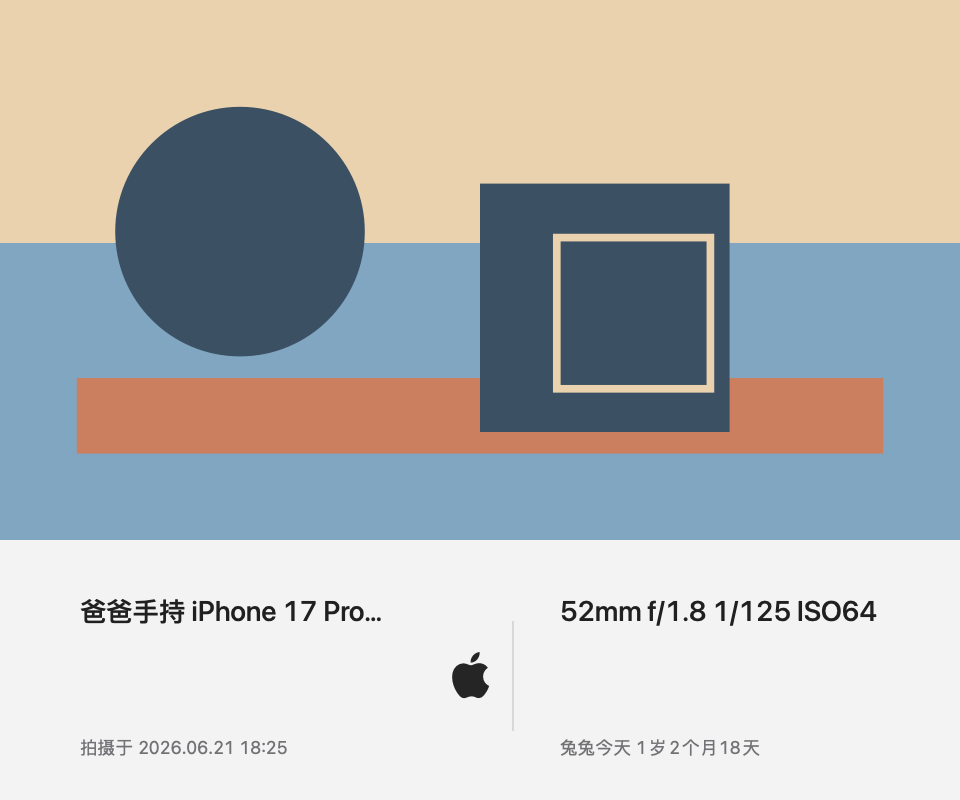
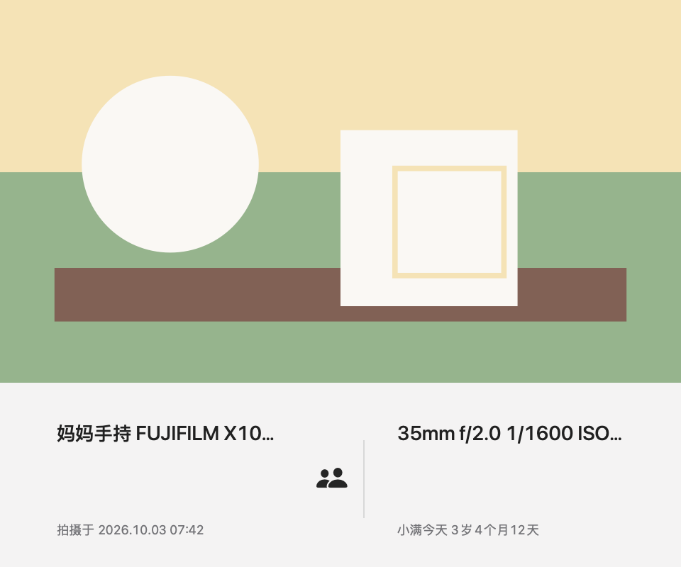
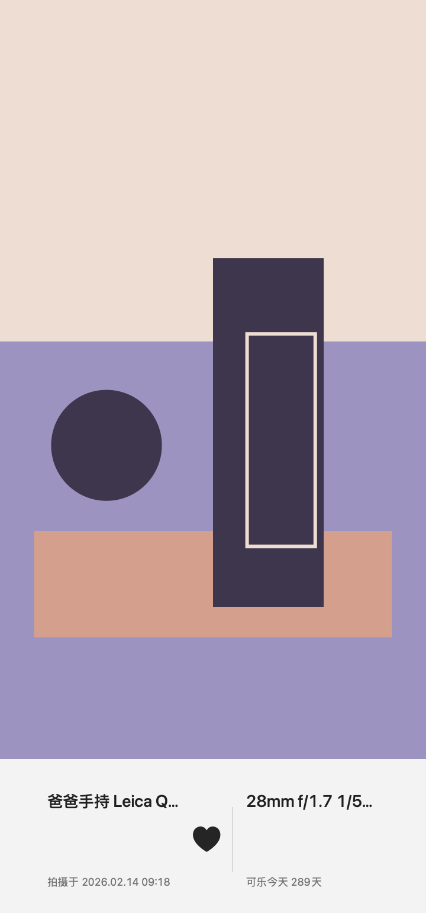

# Classic White Visual QA

Classic White now has a small fixed reference set for manual visual review.

The goal is not to compare against another product.
The goal is to keep PhotoMemo's own render language stable:

- fixed `260pt` bottom bar
- stable `40 / 20 / 40` grid
- stable typography hierarchy
- stable divider, padding, and module spacing
- truncation instead of font shrinking

The snapshot comparison is intentionally very strict, with one small exception:

- tiny color-managed export drift is tolerated only when:
  - `maxChannelDelta <= 1`
  - differing pixels stay below `0.05%`

This keeps the suite stable when reference PNGs are refreshed through Xcode result attachments, while still catching meaningful layout, spacing, typography, and truncation regressions.

## Reference Set

The snapshot references live under:

- `Tests/Fixtures/RendererSnapshots/ClassicWhite/full-card/`

Current scenarios:

1. `landscape_standard`
2. `landscape_long_exif`
3. `portrait_standard`
4. `portrait_long_memory`

## Visual Checklist

When reviewing Classic White manually, check:

1. Bottom bar height remains visually fixed and does not scale with photo ratio.
2. Left, center, and right modules still feel like a stable `40 / 20 / 40` grid.
3. Left-top and right-top text stay in the same visual tier.
4. Both bottom lines remain clearly smaller and lighter than the top lines.
5. Divider width, height, and center-module spacing remain restrained.
6. Long EXIF or memory text truncates instead of shrinking or wrapping.
7. The photo remains the emotional surface, and the bottom bar remains the information surface.

## Reference Images

### Landscape Standard



### Landscape Long EXIF



### Portrait Standard



### Portrait Long Memory


## Recording New Baselines

Only update the reference PNGs when the change is intentional.

Record mode:

```bash
touch /Users/rui/Desktop/PhotoMemo/Tests/Fixtures/RendererSnapshots/ClassicWhite/.record-mode

xcodebuild \
  -project /Users/rui/Desktop/PhotoMemo/Source/PhotoMemo/PhotoMemo.xcodeproj \
  -scheme PhotoMemoTests \
  -destination 'platform=macOS' \
  -only-testing:PhotoMemoTests/ClassicWhiteSnapshotTests \
  test
```

Then export the recorded PNG attachments from the latest `.xcresult`:

```bash
xcrun xcresulttool export attachments \
  --path /path/to/Test-PhotoMemoTests-*.xcresult \
  --output-path /tmp/photomemo-snapshot-attachments \
  --filter '*.png'
```

Copy the four PNGs into:

- `Tests/Fixtures/RendererSnapshots/ClassicWhite/full-card/landscape_standard.png`
- `Tests/Fixtures/RendererSnapshots/ClassicWhite/full-card/landscape_long_exif.png`
- `Tests/Fixtures/RendererSnapshots/ClassicWhite/full-card/portrait_standard.png`
- `Tests/Fixtures/RendererSnapshots/ClassicWhite/full-card/portrait_long_memory.png`

Then leave record mode and rerun the same tests normally:

```bash
rm /Users/rui/Desktop/PhotoMemo/Tests/Fixtures/RendererSnapshots/ClassicWhite/.record-mode

xcodebuild \
  -project /Users/rui/Desktop/PhotoMemo/Source/PhotoMemo/PhotoMemo.xcodeproj \
  -scheme PhotoMemoTests \
  -destination 'platform=macOS' \
  -only-testing:PhotoMemoTests/ClassicWhiteSnapshotTests \
  test
```
