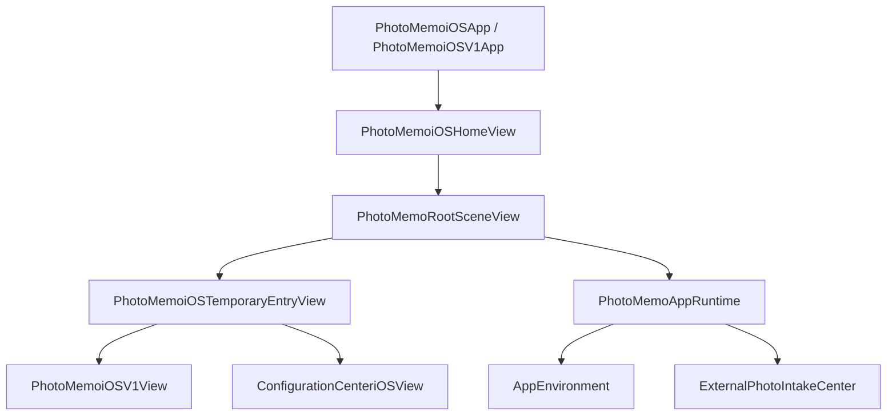

# 系统入口图

```mermaid
flowchart TD
    A["PhotoMemoiOSApp / PhotoMemoiOSV1App"] --> B["PhotoMemoiOSHomeView"]
    B --> C["PhotoMemoRootSceneView"]
    C --> D["PhotoMemoiOSTemporaryEntryView"]
    D --> E["PhotoMemoiOSV1View"]
    D --> F["ConfigurationCenteriOSView"]
    C --> G["PhotoMemoAppRuntime"]
    G --> H["AppEnvironment"]
    G --> I["ExternalPhotoIntakeCenter"]
```
