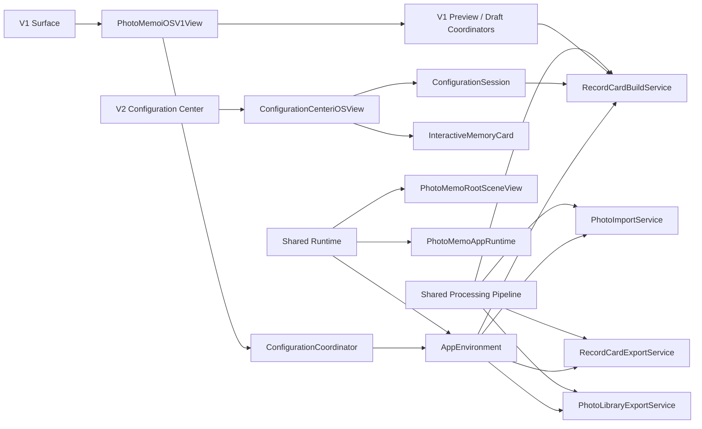

# V1 与 V2 并存边界图

```mermaid
flowchart LR
    A["V1 Surface"] --> A1["PhotoMemoiOSV1View"]
    A1 --> A2["V1 Preview / Draft Coordinators"]
    A1 --> A3["ConfigurationCoordinator"]

    B["V2 Configuration Center"] --> B1["ConfigurationCenteriOSView"]
    B1 --> B2["ConfigurationSession"]
    B1 --> B3["InteractiveMemoryCard"]

    C["Shared Runtime"] --> C1["PhotoMemoRootSceneView"]
    C --> C2["PhotoMemoAppRuntime"]
    C --> C3["AppEnvironment"]

    D["Shared Processing Pipeline"] --> D1["PhotoImportService"]
    D --> D2["RecordCardBuildService"]
    D --> D3["RecordCardExportService"]
    D --> D4["PhotoLibraryExportService"]

    A2 --> D2
    A3 --> C3
    B2 --> D2
    C3 --> D1
    C3 --> D2
    C3 --> D3
    C3 --> D4
```
