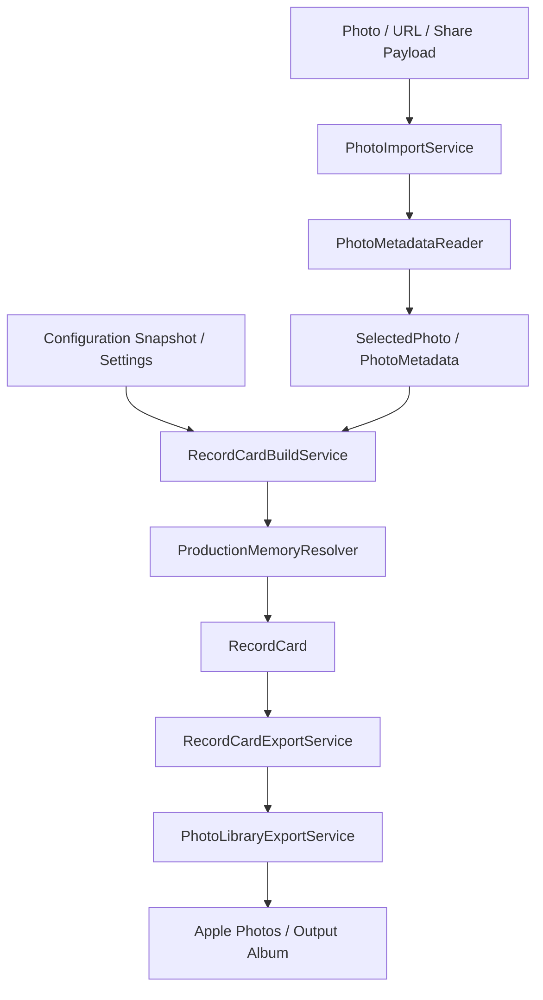

# 数据流总图

```mermaid
flowchart TD
    A["Photo / URL / Share Payload"] --> B["PhotoImportService"]
    B --> C["PhotoMetadataReader"]
    C --> D["SelectedPhoto / PhotoMetadata"]
    E["Configuration Snapshot / Settings"] --> F["RecordCardBuildService"]
    D --> F
    F --> G["ProductionMemoryResolver"]
    G --> H["RecordCard"]
    H --> I["RecordCardExportService"]
    I --> J["PhotoLibraryExportService"]
    J --> K["Apple Photos / Output Album"]
```
