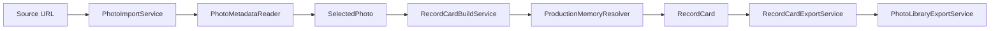

# Render Pipeline 图

```mermaid
flowchart LR
    A["Source URL"] --> B["PhotoImportService"]
    B --> C["PhotoMetadataReader"]
    C --> D["SelectedPhoto"]
    D --> E["RecordCardBuildService"]
    E --> F["ProductionMemoryResolver"]
    F --> G["RecordCard"]
    G --> H["RecordCardExportService"]
    H --> I["PhotoLibraryExportService"]
```
