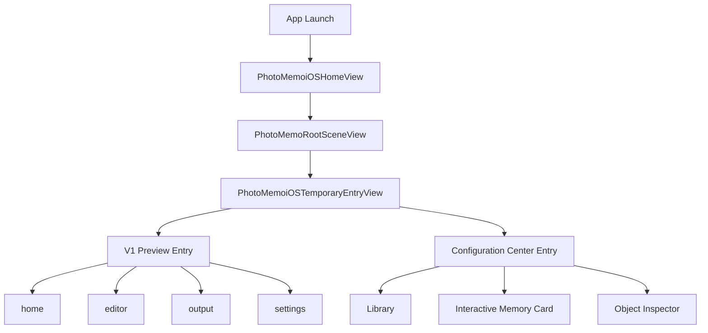

# 页面导航图

```mermaid
flowchart TD
    A["App Launch"] --> B["PhotoMemoiOSHomeView"]
    B --> C["PhotoMemoRootSceneView"]
    C --> D["PhotoMemoiOSTemporaryEntryView"]
    D --> E["V1 Preview Entry"]
    D --> F["Configuration Center Entry"]

    E --> E1["home"]
    E --> E2["editor"]
    E --> E3["output"]
    E --> E4["settings"]

    F --> F1["Library"]
    F --> F2["Interactive Memory Card"]
    F --> F3["Object Inspector"]
```
