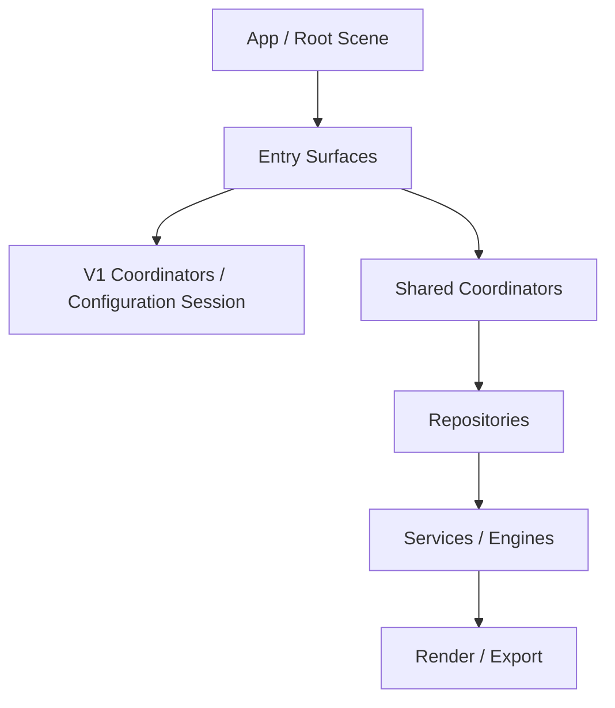

# 依赖层次图

```mermaid
flowchart TD
    A["App / Root Scene"] --> B["Entry Surfaces"]
    B --> C["V1 Coordinators / Configuration Session"]
    B --> D["Shared Coordinators"]
    D --> E["Repositories"]
    E --> F["Services / Engines"]
    F --> G["Render / Export"]
```
