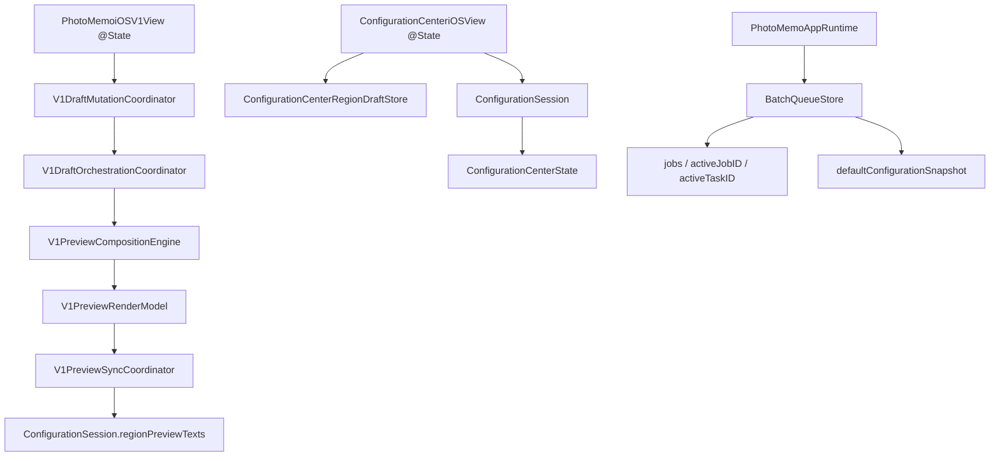

# 状态流图

```mermaid
flowchart TD
    A["PhotoMemoiOSV1View @State"] --> B["V1DraftMutationCoordinator"]
    B --> C["V1DraftOrchestrationCoordinator"]
    C --> D["V1PreviewCompositionEngine"]
    D --> E["V1PreviewRenderModel"]
    E --> F["V1PreviewSyncCoordinator"]
    F --> G["ConfigurationSession.regionPreviewTexts"]

    H["ConfigurationCenteriOSView @State"] --> I["ConfigurationCenterRegionDraftStore"]
    H --> J["ConfigurationSession"]
    J --> K["ConfigurationCenterState"]

    L["PhotoMemoAppRuntime"] --> M["BatchQueueStore"]
    M --> N["jobs / activeJobID / activeTaskID"]
    M --> O["defaultConfigurationSnapshot"]
```

## 读图方式

- V1 编辑态先经过 `V1Draft*`，再同步到 `ConfigurationSession`
- Configuration Center 的对象真相在 `ConfigurationSession / ConfigurationCenterState`
- 批处理生产状态由 `BatchQueueStore` 持有
