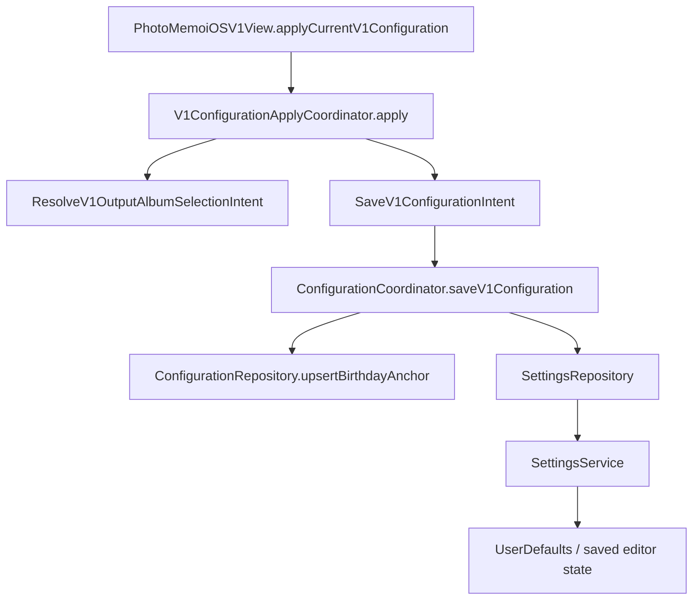

# 配置保存流图

```mermaid
flowchart TD
    A["PhotoMemoiOSV1View.applyCurrentV1Configuration"] --> B["V1ConfigurationApplyCoordinator.apply"]
    B --> C["ResolveV1OutputAlbumSelectionIntent"]
    B --> D["SaveV1ConfigurationIntent"]
    D --> E["ConfigurationCoordinator.saveV1Configuration"]
    E --> F["ConfigurationRepository.upsertBirthdayAnchor"]
    E --> G["SettingsRepository"]
    G --> H["SettingsService"]
    H --> I["UserDefaults / saved editor state"]
```

## 读图方式

- V1 页面不直接写入 defaults
- album 选择和配置保存是两个步骤
- `SettingsService` 是底层持久化重心
