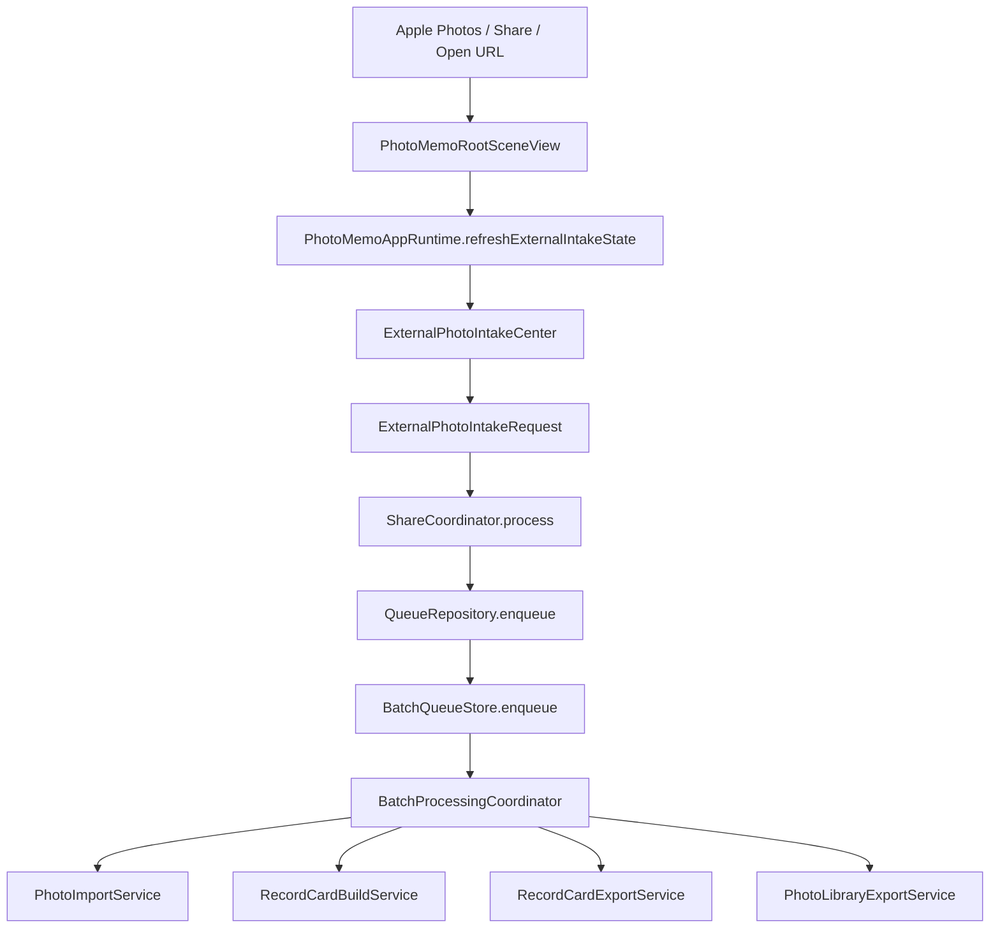

# 分享队列流图

```mermaid
flowchart TD
    A["Apple Photos / Share / Open URL"] --> B["PhotoMemoRootSceneView"]
    B --> C["PhotoMemoAppRuntime.refreshExternalIntakeState"]
    C --> D["ExternalPhotoIntakeCenter"]
    D --> E["ExternalPhotoIntakeRequest"]
    E --> F["ShareCoordinator.process"]
    F --> G["QueueRepository.enqueue"]
    G --> H["BatchQueueStore.enqueue"]
    H --> I["BatchProcessingCoordinator"]
    I --> J["PhotoImportService"]
    I --> K["RecordCardBuildService"]
    I --> L["RecordCardExportService"]
    I --> M["PhotoLibraryExportService"]
```

## 读图方式

- share intake 和 batch queue 是连续链路
- 真正生产处理在 `BatchProcessingCoordinator`
- queue 状态和默认 configuration snapshot 会影响后续输出
