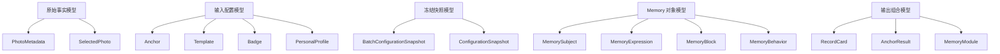

# 模型分层图

```mermaid
flowchart TD
    A["原始事实模型"] --> A1["PhotoMetadata"]
    A --> A2["SelectedPhoto"]

    B["输入配置模型"] --> B1["Anchor"]
    B --> B2["Template"]
    B --> B3["Badge"]
    B --> B4["PersonalProfile"]

    C["冻结快照模型"] --> C1["BatchConfigurationSnapshot"]
    C --> C2["ConfigurationSnapshot"]

    D["Memory 对象模型"] --> D1["MemorySubject"]
    D --> D2["MemoryExpression"]
    D --> D3["MemoryBlock"]
    D --> D4["MemoryBehavior"]

    E["输出组合模型"] --> E1["RecordCard"]
    E --> E2["AnchorResult"]
    E --> E3["MemoryModule"]
```

## 读图方式

- `PhotoMetadata` 是事实，不是表达
- `BatchConfigurationSnapshot` 是生产快照，不是页面状态
- `RecordCard` 是最终输出前的组合对象
